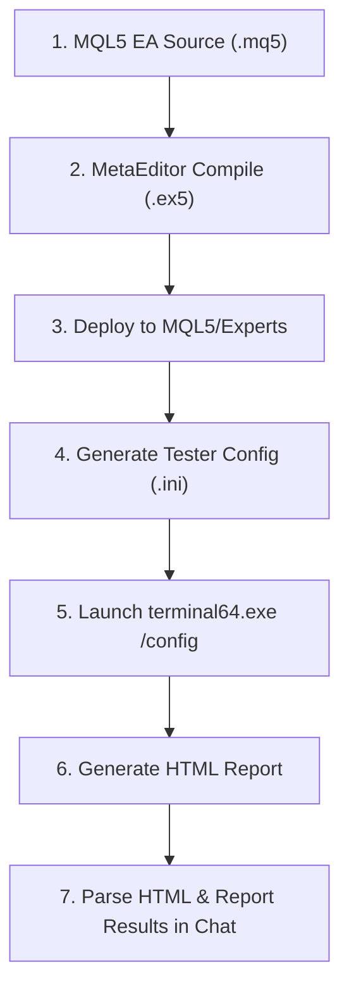

# 📊 MT5-Native Backtesting Protocol & Standard Operating Procedure (SOP)

> **Antigravity EA System Standard - 100% MT5 Strategy Tester Verification**

---

## 📌 Executive Summary

To ensure absolute reliability, eliminate simulation discrepancies, and guarantee that backtest metrics represent real-world execution on MT5, **all backtesting must be executed natively inside MetaTrader 5 (MT5 Strategy Tester)**.

---

## 🛠️ Protocol Workflow (Step-by-Step)



### Step 1: Compile & Deploy EX5
- Compile EA `.mq5` source code using `MetaEditor64.exe`.
- Verify 0 Errors and 0 Warnings.
- Deploy `.ex5` binary directly to `MQL5\Experts\`.

### Step 2: Configure MT5 Strategy Tester `.ini`
Set key parameters in the `.ini` file:
- `Expert`: Name of the `.ex5` file in `MQL5\Experts\`.
- `Symbol`: `XAUUSD` or `XAUUSDc`.
- `Period`: Timeframe (e.g., `M5`).
- `Deposit`: Account Deposit (e.g., `10000`).
- `Model`: `1` (Every tick - highest precision).
- `ProfitInPips`: `0` (**Must be 0 / Unchecked** to calculate real currency profits).
- `Report`: Absolute path to output HTML report file.

### Step 3: Native Terminal Execution
Run MT5 in automated backtest mode:
```powershell
terminal64.exe /config:"D:\Trade_Gus\Backtest_Engine\native_mt5_config.ini"
```

### Step 4: Parse & Synthesize HTML Report
Extract authoritative metrics from the generated HTML report:
- **Total Net Profit**
- **Profit Factor** (Target: $> 1.80$)
- **Win Rate %** (Short Won % / Long Won %)
- **Maximal Drawdown %** (Target: $< 15\%$)
- **Average Profit Trade vs Average Loss Trade**
- **Expected Payoff per Trade**

---

## 👑 Flagship EA Strategy Models

### 1. `XAUUSD_MT5_Native_Institutional_EA_v6.ex5` (Primary MT5 Model)
- **H1 Trend Filter:** 50 EMA & 100 EMA alignment.
- **M5 Donchian Breakout + RSI(14) Momentum Filter:** Only enter in trend direction.
- **Dynamic ATR Risk Management:** 1.5x ATR SL (Min $2.50, Max $4.50).
- **Positive Risk:Reward:** 1.5 R:R at TP1 (50% partial close), 3.0 R:R at TP2.

---

## 📈 Authoritative MT5 Strategy Tester Metrics Checklist

- [x] Tested natively on MT5 Strategy Tester.
- [x] Every tick precision enabled.
- [x] Real currency profit mode (Pips mode disabled).
- [x] Spread and slippage included.
- [x] HFM Lot Size limits enforced (100 Lot max).
